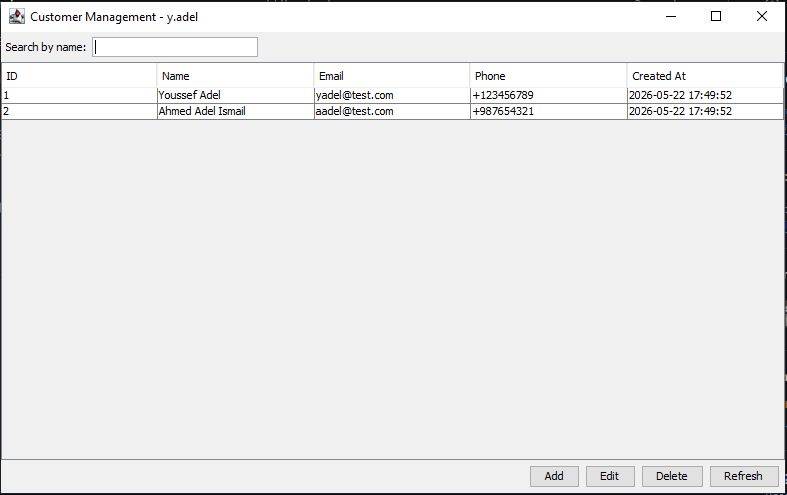
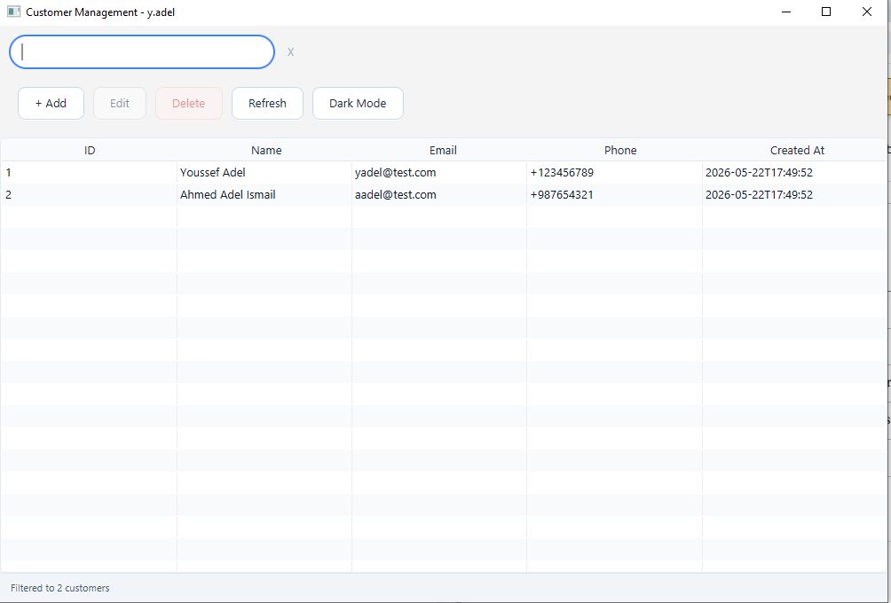
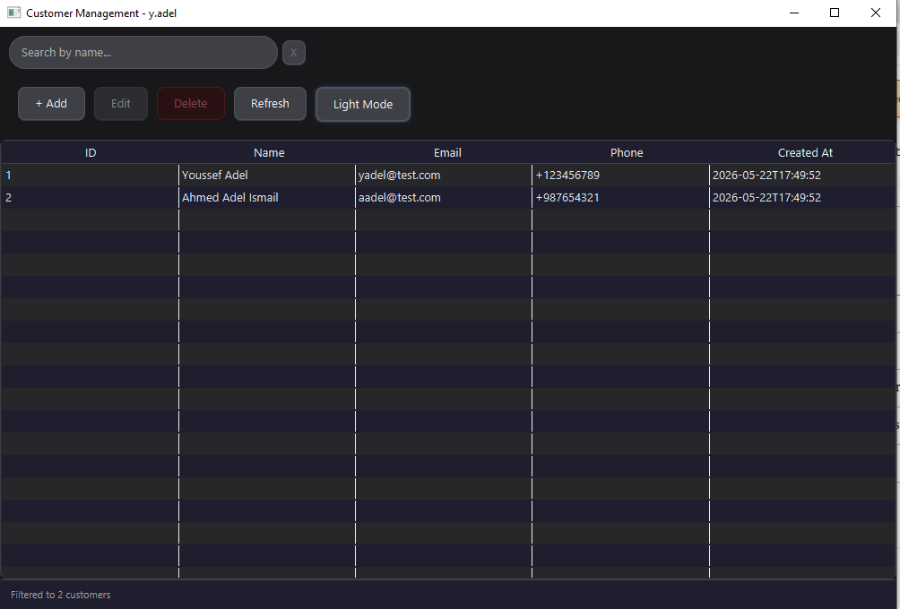
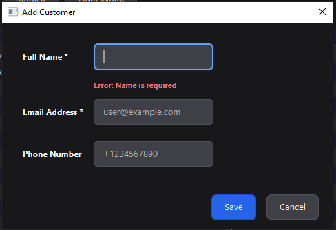
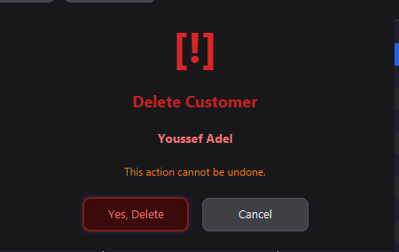

<div align="center">

# Customer Management Application

**A full‑stack desktop CRM built with Spring Boot + JavaFX**


The desktop client communicates **exclusively via HTTP** with the backend — no direct database access.  
Modern UI with **dark/light theme**, real‑time validation, and keyboard shortcuts.

> 🚀 **v2.0** — Fully migrated from Swing → JavaFX with major UI overhaul and first planned enhancement shipped.

</div>

---

## 📐 Architecture

```
┌──────────────────────────┐   HTTP / REST    ┌──────────────────────────┐
│     JavaFX Client        │ ───────────────► │   Spring Boot Backend    │
│                          │  Bearer <token>  │                          │
│  • TableView (data)      │ ◄─────────────── │  • GET  /api/customers   │
│  • Add / Edit dialog     │   JSON responses │  • POST /api/customers   │
│  • Search / filter bar   │                  │  • PUT  /api/customers   │
│  • Dark/Light mode toggle│                  │  • DELETE /api/customers │
│  • Keyboard shortcuts    │                  └────────────┬─────────────┘
└──────────────────────────┘                               │ JDBC / MySQL
                                              ┌────────────▼─────────────┐
                                              │      MySQL Database       │
                                              │       customer_db         │
                                              │    table: customers       │
                                              │  id · name · email ·      │
                                              │  phone · created_at       │
                                              └──────────────────────────┘
```

---

## 🖼️ Screenshots

### 🌓 Dark / Light Mode — Before & After

> The UI was completely redesigned when migrating from Swing to JavaFX, introducing full theme support.

#### Light Theme

|                 Before (Swing)                  |                    After (JavaFX)                     |
| :---------------------------------------------: | :---------------------------------------------------: |
|  |  |
|  Basic Swing look-and-feel, no custom styling   |   Custom CSS, rounded corners, card layout, shadows   |

#### Dark Theme (not applied before)

|                 Before (Swing)                 |                    After (JavaFX)                    |
| :--------------------------------------------: | :--------------------------------------------------: |
|  |   |
| System dark mode only (OS-level), inconsistent | Full built-in dark theme with smooth fade transition |

> 💡 **Before:** Swing's default rendering engine with OS look-and-feel — flat, inconsistent across platforms.  
> ✅ **After:** JavaFX with hand-crafted CSS — pixel-perfect dark & light themes, platform-independent.

---

### All Windows

|                         Add / Edit Dialog                         |                     Delete Confirmation                     |
| :---------------------------------------------------------------: | :---------------------------------------------------------: |
|  |  |

---

## ✨ Features

### Backend (Spring Boot)

- Full CRUD REST API (`/api/customers`)
- MySQL database with automatic table creation
- API key authentication (`Bearer my-secret-token`)
- Input validation (`@NotBlank`, `@Email`)
- Proper HTTP status codes (200, 201, 204, 400, 401, 404, 500)

### Desktop Client (JavaFX)

- **Modern UI** – custom CSS, rounded corners, shadows
- **Dark / Light theme** – toggle with smooth fade transition
- **Keyboard shortcuts** – `Ctrl+N` (Add), `Ctrl+E` (Edit), `Delete` (Delete), `Ctrl+R` (Refresh), `Ctrl+F` (search focus)
- **Real‑time search** – filter customers by name while typing
- **Inline form validation** – live error messages in add/edit dialog
- **Stylish delete confirmation** – custom dialog with warning icon and red customer name
- **Loading indicators** – progress indicator in status bar
- **Double‑click to edit** – fast editing from table
- **Disable Edit/Delete when no selection** – better UX
- **Toast‑like status messages** – temporary non‑intrusive feedback

---

## 🚀 Prerequisites

| Tool             | Version  | Guide                                                                           |
| ---------------- | -------- | ------------------------------------------------------------------------------- |
| Java JDK         | 11 or 17 | [Eclipse Temurin](https://adoptium.net) · [Oracle JDK](https://oracle.com/java) |
| Apache Maven     | 3.6+     | [maven.apache.org](https://maven.apache.org/download.cgi)                       |
| MySQL Server     | 8.0+     | [MySQL Community Server](https://dev.mysql.com/downloads/mysql/)                |
| Git _(optional)_ | latest   | [git-scm.com](https://git-scm.com)                                              |

### Set environment variables (Windows)

```cmd
JAVA_HOME=C:\Program Files\Eclipse Adoptium\jdk-11.0.26.9-hotspot
Path=%JAVA_HOME%\bin;%Path%
```

Verify:

```bash
java -version
javac -version
mvn -version
mysql --version
```

---

## 📥 Installation & Setup

### 1 · Clone the repository

```bash
git clone https://github.com/YoussefAdel170/customer-management-app.git
cd customer-management-app
```

### 2 · Create the database

```bash
# Command Prompt
mysql -u root -p < create_database.sql

# PowerShell
Get-Content create_database.sql | mysql -u root -p
```

This creates the `customer_db` database and the `customers` table, pre‑loaded with sample data.

### 3 · Configure the backend

Edit `customer-backend/src/main/resources/application.properties`:

```properties
spring.datasource.url=jdbc:mysql://localhost:3306/customer_db?useSSL=false&serverTimezone=UTC&allowPublicKeyRetrieval=true
spring.datasource.username=root
spring.datasource.password=YOUR_MYSQL_PASSWORD

api.key=my-secret-token
```

### 4 · Start the backend

```bash
cd customer-backend
mvn spring-boot:run
```

The API is now live at `http://localhost:8080`.

### 5 · Start the JavaFX client

Open a new terminal:

```bash
cd customer-client
mvn clean javafx:run
```

Alternative — run as a standalone JAR:

```bash
mvn clean package
java -jar target/customer-client-javafx-1.0.0.jar
```

---

## 🖱️ Usage Guide

| Action             | Steps                                             | Shortcut     |
| ------------------ | ------------------------------------------------- | ------------ |
| View all customers | Loaded automatically on startup                   | –            |
| Search / filter    | Type in the search box → filters live by name     | `Ctrl+F`     |
| Add a customer     | Click **Add** → fill form (name & email required) | `Ctrl+N`     |
| Edit a customer    | Double‑click a row or select + click **Edit**     | `Ctrl+E`     |
| Delete a customer  | Select a row → **Delete** → confirm               | `Delete` key |
| Refresh data       | Click **Refresh**                                 | `Ctrl+R`     |
| Toggle theme       | Click **Dark/Light Mode** button                  | –            |

All network operations show a loading indicator. Errors appear in styled dialogs.

---

## 🔐 API Security

All requests require a Bearer token header:

```
Authorization: Bearer my-secret-token
```

Update the token in two places:

| File                                          | Property / Constant |
| --------------------------------------------- | ------------------- |
| `customer-backend/.../application.properties` | `api.key`           |
| `customer-client/.../CustomerApiService.java` | `API_KEY`           |

Test with curl:

```bash
curl -H "Authorization: Bearer my-secret-token" http://localhost:8080/api/customers
```

---

## 🧪 API Reference

| Endpoint              | Method   | Description                 | Body |
| --------------------- | -------- | --------------------------- | ---- |
| `/api/customers`      | `GET`    | Get all customers           | —    |
| `/api/customers/{id}` | `GET`    | Get a single customer       | —    |
| `/api/customers`      | `POST`   | Create a new customer       | JSON |
| `/api/customers/{id}` | `PUT`    | Update an existing customer | JSON |
| `/api/customers/{id}` | `DELETE` | Delete a customer           | —    |

Request / Response body:

```json
{
  "name": "Youssef Adel",
  "email": "yadel@test.com",
  "phone": "+123456789"
}
```

---

## 🛠️ Tech Stack

| Technology      | Role                          |
| --------------- | ----------------------------- |
| Spring Boot 2.7 | REST API backend              |
| MySQL 8.0       | Relational database           |
| JavaFX          | Modern desktop UI framework   |
| Gson            | JSON serialization            |
| Apache Maven    | Build & dependency management |

---

## 🗺️ Future Enhancements

This section tracks planned improvements to the application, with status badges for each.

### ✅ Enhancement #1 — Swing → JavaFX Migration _(Completed)_

> **Goal:** Replace the outdated Swing UI with a modern JavaFX-based interface.

**What changed:**

| Area             | Before (Swing)                 | After (JavaFX)                          |
| ---------------- | ------------------------------ | --------------------------------------- |
| UI Framework     | `javax.swing.*`                | `javafx.scene.*`                        |
| Theming          | OS look-and-feel only          | Full custom CSS dark/light themes       |
| Table            | `JTable` + `DefaultTableModel` | `TableView` + `ObservableList`          |
| Dialogs          | `JDialog`                      | Custom `Stage` / `Dialog`               |
| Background tasks | `SwingWorker`                  | `Task<>` + `Platform.runLater()`        |
| Entry point      | `SwingUtilities.invokeLater`   | `Application.launch()`                  |
| Animations       | ❌ Not supported               | ✅ Fade transitions, loading indicators |
| Custom styling   | ❌ Very limited                | ✅ Full CSS support per component       |

**Result:** The application now runs on a fully custom-styled, platform-independent JavaFX UI with dark/light mode, smooth animations, and keyboard shortcuts — a major improvement in user experience over the legacy Swing version.

---

### ⏳ Enhancement #2 — Export to CSV / PDF _(Planned)_

Allow users to export the current customer list (including active search filters) to a `.csv` or `.pdf` file directly from the UI.

**Planned approach:**

- Add an **Export** button to the toolbar
- Use Apache POI or OpenCSV for CSV export
- Use iText or Apache PDFBox for PDF export
- Respect the currently applied search filter (export what you see)

---

### ⏳ Enhancement #3 — Pagination _(Planned)_

Add server-side pagination to handle large datasets efficiently.

**Planned approach:**

- Add `?page=0&size=20` query parameters to `GET /api/customers`
- Add Spring Data `Pageable` support to the backend
- Add page navigation controls (Prev / Next / page number) to the JavaFX client

---

### ⏳ Enhancement #4 — User Authentication & Roles _(Planned)_

Replace the static API key with a proper login system supporting multiple users and role-based access (Admin / Viewer).

**Planned approach:**

- Add Spring Security with JWT token generation on login
- Add a JavaFX login screen before the main window
- Restrict delete/edit operations to Admin role only

---

### ⏳ Enhancement #5 — Audit Log / Activity History _(Planned)_

Record every create, update, and delete action with a timestamp and user identifier, viewable from within the application.

**Planned approach:**

- Add an `audit_log` table to MySQL
- Hook into the service layer to write log entries on mutations
- Add an **Activity Log** side panel or separate tab in the JavaFX UI

---

## 📂 Project Documentation

- [`FILE_REFERENCE.md`](FILE_REFERENCE.md) – Detailed responsibilities of every file in the backend and client projects.
- [`TROUBLESHOOTING.md`](TROUBLESHOOTING.md) – Complete log of all issues encountered during setup and how they were solved.

---

## 👤 Author

**Youssef Adel**  
GitHub: [@YoussefAdel170](https://github.com/YoussefAdel170)  
Project: [github.com/YoussefAdel170/customer-management-app](https://github.com/YoussefAdel170/customer-management-app)

---

## 📄 License

This project was built for educational purposes as part of a developer test task.

---

## 🙏 Acknowledgements

- **Oracle** — Java platform and JavaFX framework
- **Spring community** — Spring Boot
- **MySQL team** — database engine
- **Gluon** — JavaFX Maven plugin

---

> **Migration Note:** The desktop client has been completely migrated from Swing to JavaFX (Enhancement #1 ✅), featuring a modular component architecture, full theming support, and a significantly enhanced user experience. See the [Before & After screenshots](#-dark--light-mode--before--after) and [Enhancement #1](#-enhancement-1--swing--javafx-migration-completed) for the full comparison.
