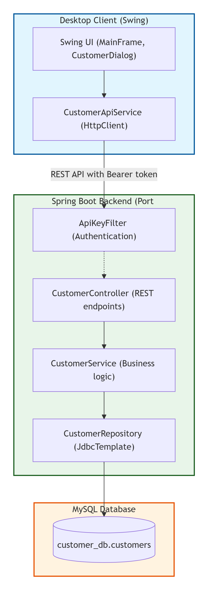
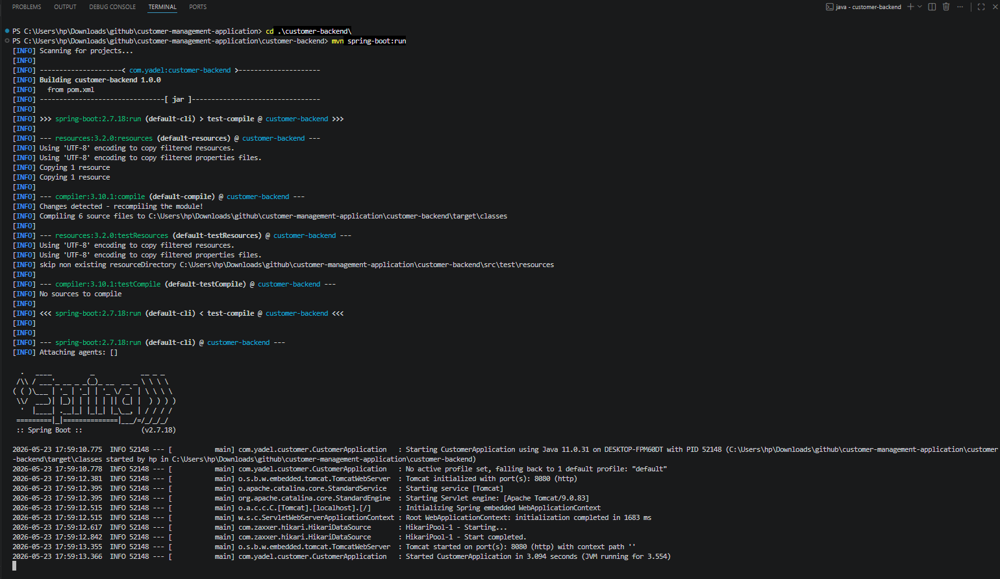
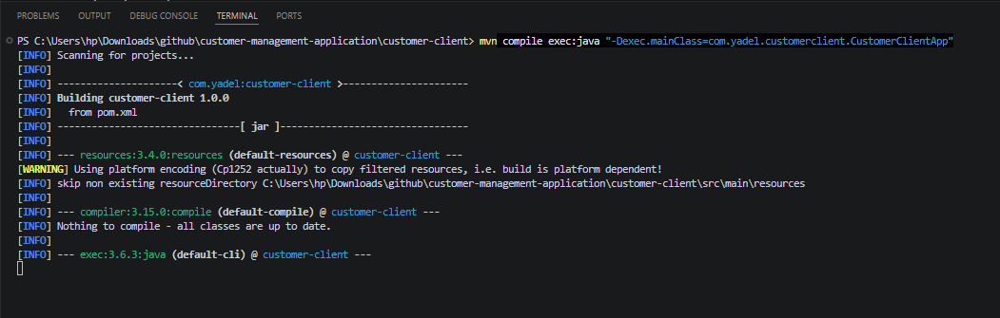
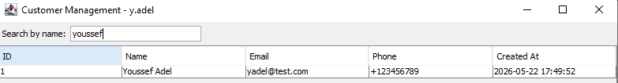
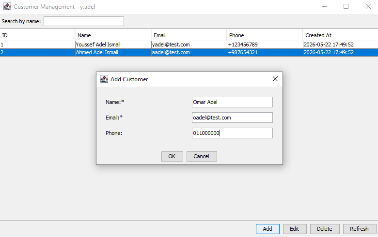
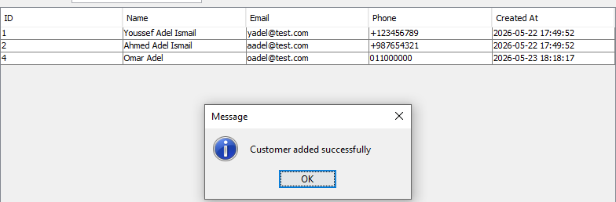
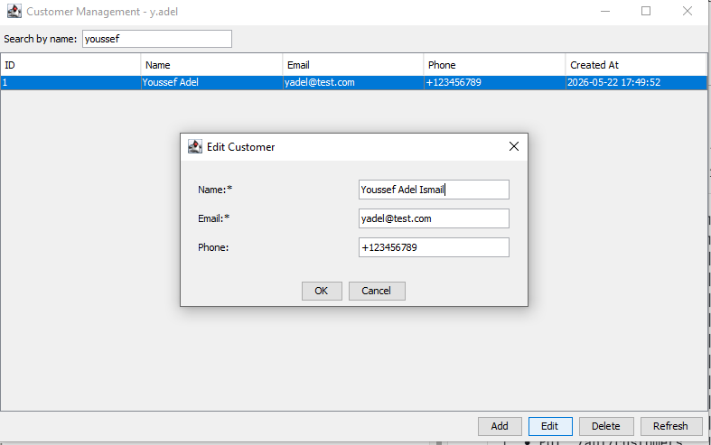
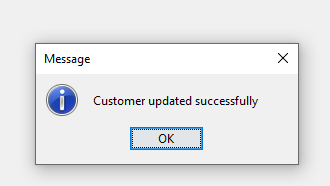
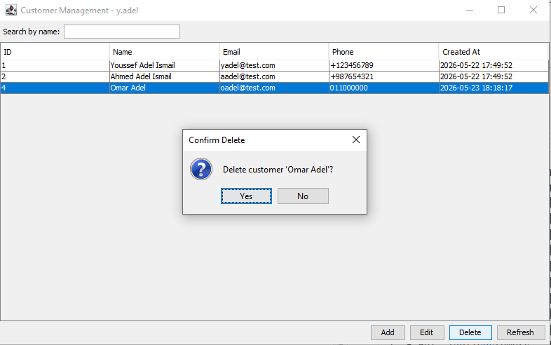
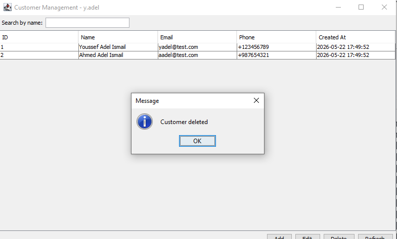

<div align="center">

# Customer Management Application

**A full-stack desktop CRM built with Spring Boot + Java Swing**


The desktop client communicates **exclusively via HTTP** with the backend — no direct database access.

</div>

---

## 📐 Architecture

The ASCII diagram below shows the system design. The screenshot beside it is the full architecture diagram from the project documentation.

```
┌──────────────────────────┐           HTTP / REST            ┌──────────────────────────┐
│     Java Swing Client    │ ──────────────────────────────►  │   Spring Boot Backend    │
│                          │   Authorization: Bearer <token>  │                          │
│  • Main window (table)   │ ◄──────────────────────────────  │  • GET  /api/customers   │
│  • Add / Edit dialog     │         JSON responses           │  • POST /api/customers   │
│  • Search / filter bar   │                                  │  • PUT  /api/customers   │
│  • Delete confirmation   │                                  │  • DELETE /api/customers │
└──────────────────────────┘                                  └────────────┬─────────────┘
                                                                           │  JDBC / MySQL
                                                              ┌────────────▼─────────────┐
                                                              │      MySQL Database       │
                                                              │       customer_db         │
                                                              │   table: customers        │
                                                              │  id · name · email ·      │
                                                              │  phone · created_at       │
                                                              └──────────────────────────┘
```

> 📸 **Full architecture diagram:**
>
> 

---

## 📸 Application Screenshots

### Main Window — Customer Table

> The main screen loads all customers automatically on launch via `GET /api/customers`.


---

### Running the Backend

> Spring Boot starts on port `8080` and connects to MySQL. You should see `Started CustomerApplication` in the terminal output.



---

### Running the Desktop Client

> The Swing client launches, authenticates with the Bearer token, and fetches all customers from the API.



---

### Get All Customers

> All records are loaded into the table on startup and on every **Refresh** click (`GET /api/customers`).


---

### Get a Specific Customer (Search / Filter by Name)

> Selecting a row fetches that customer's full details (`GET /api/customers/{id}`).
> Type any text in the **Search by name** field — the table filters live as you type.



---

### Add a New Customer

> Click **Add** to open the dialog. Name is required; email must be valid; phone is optional. Submits `POST /api/customers`.




---

### Edit a Customer

> Select a row and click **Edit**. The dialog pre-fills all fields. On **OK** it sends `PUT /api/customers/{id}`.




---

### Delete a Customer

> Select a row and click **Delete**. A confirmation dialog appears before sending `DELETE /api/customers/{id}`.




---

## 🚀 Prerequisites

| Tool             | Version  | Guide                                                                           |
| ---------------- | -------- | ------------------------------------------------------------------------------- |
| Java JDK         | 11 or 17 | [Eclipse Temurin](https://adoptium.net) · [Oracle JDK](https://oracle.com/java) |
| Apache Maven     | 3.6+     | [maven.apache.org](https://maven.apache.org/download.cgi)                       |
| MySQL Server     | 8.0+     | [MySQL Community Server](https://dev.mysql.com/downloads/mysql/)                |
| Git _(optional)_ | latest   | [git-scm.com](https://git-scm.com)                                              |

### Set environment variables (Windows)

```cmd
JAVA_HOME=C:\Program Files\Eclipse Adoptium\jdk-11.0.26.9-hotspot
Path=%JAVA_HOME%\bin;%Path%
```

Verify everything is ready:

```bash
java -version
javac -version
mvn -version
mysql --version
```

---

## 📥 Installation & Setup

### 1 · Clone the repository

```bash
git clone https://github.com/YoussefAdel170/customer-management-application.git
cd customer-management-application
```

### 2 · Create the database

```bash
# Command Prompt
mysql -u root -p < create_database.sql

# PowerShell
Get-Content create_database.sql | mysql -u root -p
```

This creates the `customer_db` database and the `customers` table, pre-loaded with sample data.

### 3 · Configure the backend

Edit `customer-backend/src/main/resources/application.properties`:

```properties
spring.datasource.url=jdbc:mysql://localhost:3306/customer_db?useSSL=false&serverTimezone=UTC&allowPublicKeyRetrieval=true
spring.datasource.username=root
spring.datasource.password=YOUR_MYSQL_PASSWORD

api.key=my-secret-token
```

### 4 · Start the backend

```bash
cd customer-backend
mvn spring-boot:run
```

The API is now live at **http://localhost:8080**.

### 5 · Start the desktop client

Open a **new terminal**:

```bash
cd customer-client
mvn compile exec:java "-Dexec.mainClass=com.yadel.customerclient.CustomerClientApp"
```

**Alternative — run as a standalone JAR:**

```bash
mvn clean package
java -jar target/customer-client-1.0.0.jar
```

---

## 🖱️ Usage Guide

| Action                      | Steps                                               |
| --------------------------- | --------------------------------------------------- |
| **View all customers**      | Loaded automatically on startup                     |
| **Get a specific customer** | Select any row in the table                         |
| **Search / filter**         | Type in the **Search by name** field — filters live |
| **Add a customer**          | Click **Add** → fill form → **OK**                  |
| **Edit a customer**         | Select row → **Edit** → modify → **OK**             |
| **Delete a customer**       | Select row → **Delete** → confirm                   |
| **Refresh data**            | Click **Refresh** to re-fetch from the API          |

> All network operations show a loading cursor. Errors are shown in message dialogs.

---

## 🔐 API Security

All requests require a **Bearer token** header:

```
Authorization: Bearer my-secret-token
```

Update the token in two places:

| File                                          | Property / Constant |
| --------------------------------------------- | ------------------- |
| `customer-backend/.../application.properties` | `api.key`           |
| `customer-client/.../CustomerApiService.java` | `API_KEY`           |

**Test with curl:**

```bash
curl -H "Authorization: Bearer my-secret-token" http://localhost:8080/api/customers
```

---

## 🧪 API Reference

| Endpoint              | Method   | Description                 | Body |
| --------------------- | -------- | --------------------------- | ---- |
| `/api/customers`      | `GET`    | Get all customers           | —    |
| `/api/customers/{id}` | `GET`    | Get a single customer       | —    |
| `/api/customers`      | `POST`   | Create a new customer       | JSON |
| `/api/customers/{id}` | `PUT`    | Update an existing customer | JSON |
| `/api/customers/{id}` | `DELETE` | Delete a customer           | —    |

**Request / Response body:**

```json
{
  "name": "Youssef Adel",
  "email": "yadel@test.com",
  "phone": "+123456789"
}
```

---

## 🔮 Planned Enhancements

<details>
<summary><strong>UI improvements</strong></summary>

- Migrate from Swing to JavaFX for a modern look and feel
- Dark / light theme toggle
- Responsive layouts with custom CSS (JavaFX)

</details>

<details>
<summary><strong>Authentication & authorization</strong></summary>

- User login / signup with roles (`ADMIN`, `USER`)
- JWT tokens replacing the static API key
- Role-based endpoint security (e.g. only admins can delete)

</details>

<details>
<summary><strong>Extra features</strong></summary>

- Pagination: `GET /customers?page=0&size=10`
- Multi-column sorting and filtering
- Export to CSV / Excel from the client
- Dashboard with customer creation trend charts
- Email notifications on add / update
- Audit log (who changed what and when)

</details>

<details>
<summary><strong>Deployment</strong></summary>

- Dockerize backend + MySQL
- Deploy to AWS / Heroku / Render
- Web frontend (React or Angular) as an alternative client

</details>

---

## 🛠️ Tech Stack

| Technology                                                     | Role                          |
| -------------------------------------------------------------- | ----------------------------- |
| [Spring Boot 2.7](https://spring.io/projects/spring-boot)      | REST API backend              |
| [MySQL 8.0](https://www.mysql.com)                             | Relational database           |
| [Java Swing](https://docs.oracle.com/javase/tutorial/uiswing/) | Desktop UI                    |
| [Gson](https://github.com/google/gson)                         | JSON serialization            |
| [Apache Maven](https://maven.apache.org)                       | Build & dependency management |

---

## 👤 Author

**Youssef Adel**  
GitHub: [@YoussefAdel170](https://github.com/YoussefAdel170)  
Project: [github.com/YoussefAdel170/customer-management-app](https://github.com/YoussefAdel170/customer-management-app)

---

## 📄 License

This project was built for educational purposes as part of a developer test task.

---

## 🙏 Acknowledgements

- Oracle — Java platform and Swing framework
- Spring community — Spring Boot
- MySQL team — database engine

---

## 📂 Project Documentation

- **[FILE_REFERENCE.md](FILE_REFERENCE.md)** – Detailed responsibilities of every file in the backend and client projects.
- **[TROUBLESHOOTING.md](TROUBLESHOOTING.md)** – Complete log of all issues encountered during setup and how they were solved.
